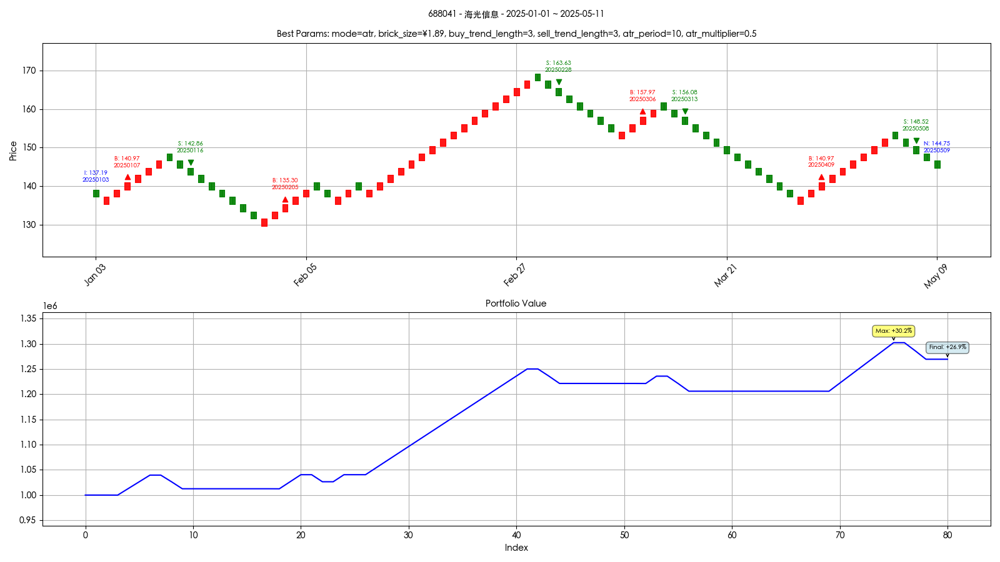

# Renko回测系统

这是一个基于砖型图(Renko)的量化交易回测系统。

## 项目结构

- `data/`: 数据存储目录
- `src/`: 源代码目录
  - `data_fetcher.py`: 数据获取模块
  - `renko_generator.py`: 砖型图生成模块
  - `strategy.py`: 交易策略模块
  - `backtest.py`: 回测引擎模块
  - `analysis.py`: 结果分析模块
  - `backtest_optimizer.py`: 参数优化模块

## 安装依赖

```bash
pip install -r requirements.txt
```

## 使用方法

### 命令行参数说明

程序支持以下命令行参数：

- `--token`: API访问令牌（必需）
  - 用于访问数据源的认证令牌
  - 示例：`--token "your_token_here"`

- `--symbol`: 股票代码（必需）
  - 要回测的股票代码
  - 格式：股票代码.交易所代码
  - 示例：`--symbol "688041.SH"`

- `--start_date`: 开始日期（必需）
  - 回测开始日期
  - 格式：YYYY-MM-DD
  - 示例：`--start_date "2024-05-01"`

- `--end_date`: 结束日期（必需）
  - 回测结束日期
  - 格式：YYYY-MM-DD
  - 示例：`--end_date "2025-05-01"`

- `--renko_mode`: Renko生成模式（可选）
  - 选择Renko图的生成算法
  - 可选值：`daily`（基于日线）或`atr`（基于ATR）
  - 默认值：`daily`
  - 示例：`--renko_mode "daily"`

- `--atr_period`: ATR周期（可选）
  - 当使用ATR模式时，设置ATR的计算周期
  - 默认值：14
  - 示例：`--atr_period 20`

- `--atr_multiplier`: ATR乘数（可选）
  - 当使用ATR模式时，设置ATR的乘数
  - 默认值：1.0
  - 示例：`--atr_multiplier 1.5`

- `--buy_trend_length`: 买入趋势长度（可选）
  - 设置生成买入信号所需的趋势长度
  - 默认值：3
  - 示例：`--buy_trend_length 5`

- `--sell_trend_length`: 卖出趋势长度（可选）
  - 设置生成卖出信号所需的趋势长度
  - 默认值：3
  - 示例：`--sell_trend_length 5`

- `--optimize`: 启用参数优化（可选）
  - 是否启用参数优化功能
  - 启用后将自动测试不同参数组合
  - 示例：`--optimize`

- `--max_iterations`: 最大优化迭代次数（可选）
  - 当启用参数优化时，设置最大测试轮数
  - 默认值：500
  - 示例：`--max_iterations 50`

### 运行示例

```bash
# 使用日线模式
python src/main.py --token "your_token_here" --symbol "688041.SH" --start_date "2024-05-01" --end_date "2025-05-01" --renko_mode "daily"

# 使用ATR模式
python src/main.py --token "your_token_here" --symbol "688041.SH" --start_date "2024-05-01" --end_date "2025-05-01" --renko_mode "atr" --atr_period 14 --atr_multiplier 1.0

# 启用参数优化
python src/main.py --token "your_token_here" --symbol "688041.SH" --start_date "2024-05-01" --end_date "2025-05-01" --optimize --max_iterations 100
```

### 参数优化说明

当启用参数优化时，系统会：

1. 测试 daily 模式
2. 测试 atr 模式的不同参数组合：
   - ATR周期：[3, 5, 10, 14, 20, 30]
   - ATR乘数：[0.5, 1.0, 1.5, 2.0]
3. 记录每种参数组合的收益率
4. 输出所有测试结果，并按收益率排序
5. 使用最优参数运行回测并绘制结果

### 输出说明

程序运行后会输出：
1. 获取到的数据条数
2. 回测结果：
   - 初始资金
   - 最终资金
   - 收益率
3. 可视化图表：
   - 股票价格走势图（包含买卖信号）
   - 投资组合价值变化图

示例输出图表：


当启用参数优化时，还会输出：
1. 所有测试的参数组合及其收益率
2. 最优参数组合的详细信息

## 注意事项

- 需要安装TA-Lib库
- 建议使用Python 3.8+
- 确保API令牌有效且具有足够的访问权限
- 日期格式必须严格按照YYYY-MM-DD格式输入
- 参数优化可能需要较长时间，建议根据实际情况设置合适的max_iterations值 